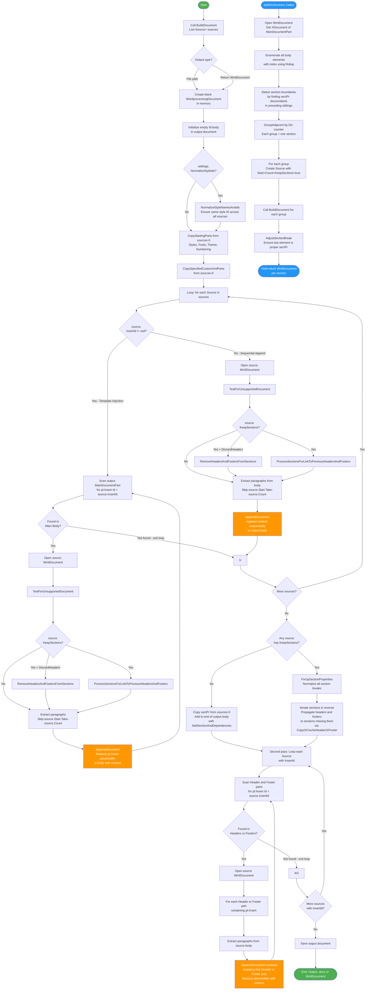

```mermaid
flowchart TD
    A([Start]) --> B[Call BuildDocument\nList&lt;Source&gt; sources]

    B --> C{Output type?}
    C -->|File path| D[Create blank WordprocessingDocument\nin memory]
    C -->|Return WmlDocument| D

    D --> E[Initialize empty W.body\nin output document]
    E --> F{settings.\nNormalizeStyleIds?}
    F -->|Yes| G[NormalizeStyleNamesAndIds\nEnsure same style ID across all sources]
    F -->|No| H
    G --> H[CopyStartingParts from sources-0\nStyles, Fonts, Theme, Numbering]
    H --> I[CopySpecifiedCustomXmlParts\nfrom sources-0]

    I --> J[Loop: for each Source in sources]

    J --> K{source.\nInsertId != null?}

    %% INSERT ID BRANCH - Main Body
    K -->|Yes - Template Injection| L[Scan output MainDocumentPart\nfor pt:Insert Id = source.InsertId]
    L --> M{Found in\nMain Body?}
    M -->|Yes| N[Open source WmlDocument]
    N --> O[TestForUnsupportedDocument]
    O --> P{source.\nKeepSections?}
    P -->|Yes + DiscardHeaders| Q[RemoveHeadersAndFootersFromSections]
    P -->|Yes| R[ProcessSectionsForLinkToPreviousHeadersAndFooters]
    P -->|No| S
    Q --> S[Extract paragraphs\nSkip-source.Start Take-source.Count]
    R --> S
    S --> T[AppendDocument\nReplace pt:Insert placeholder\nin body with content]
    T --> L
    M -->|Not found - exit loop| U

    %% SEQUENTIAL APPEND BRANCH
    K -->|No - Sequential Append| V[Open source WmlDocument]
    V --> W[TestForUnsupportedDocument]
    W --> X{source.\nKeepSections?}
    X -->|Yes + DiscardHeaders| Y[RemoveHeadersAndFootersFromSections]
    X -->|Yes| Z[ProcessSectionsForLinkToPreviousHeadersAndFooters]
    X -->|No| AA
    Y --> AA[Extract paragraphs from body\nSkip-source.Start Take-source.Count]
    Z --> AA
    AA --> AB[AppendDocument\nAppend content sequentially\nto output body]
    AB --> U

    U --> AC{More sources?}
    AC -->|Yes| J
    AC -->|No| AD

    %% SECTION HANDLING
    AD{Any source\nhas KeepSections?}
    AD -->|No| AE[Copy sectPr from sources-0\nAdd to end of output body\nwith AddSectionAndDependencies]
    AD -->|Yes| AF[FixUpSectionProperties\nNormalize all section breaks]
    AF --> AG[Iterate sections in reverse\nPropagate headers and footers\nto sections missing them\nvia CopyOrCacheHeaderOrFooter]
    AE --> AH
    AG --> AH

    %% HEADERS / FOOTERS INSERT ID PASS
    AH[Second pass: Loop each Source\nwith InsertId]
    AH --> AI[Scan Header and Footer parts\nfor pt:Insert Id = source.InsertId]
    AI --> AJ{Found in\nHeaders or Footers?}
    AJ -->|Yes| AK[Open source WmlDocument]
    AK --> AL[For each Header or Footer part\ncontaining pt:Insert]
    AL --> AM[Extract paragraphs from source body]
    AM --> AN[AppendDocument overload\ntargeting that Header or Footer part\nReplace placeholder with content]
    AN --> AI
    AJ -->|Not found - exit loop| AO
    AO --> AP{More sources\nwith InsertId?}
    AP -->|Yes| AH
    AP -->|No| AQ

    AQ[Save output document] --> AR([End: Output .docx or WmlDocument])

    %% SPLIT ON SECTIONS - Side flow
    BA([SplitOnSections Called]) --> BB[Open WmlDocument\nGet XDocument of MainDocumentPart]
    BB --> BC[Enumerate all body elements\nwith index using Rollup]
    BC --> BD[Detect section boundaries\nby finding sectPr descendants\nin preceding siblings]
    BD --> BE[GroupAdjacent by Div counter\nEach group = one section]
    BE --> BF[For each group\nCreate Source with Start+Count+KeepSections=true]
    BF --> BG[Call BuildDocument for each group]
    BG --> BH[AdjustSectionBreak\nEnsure last element is proper sectPr]
    BH --> BI([Yield return WmlDocument\nper section])

    style A fill:#4CAF50,color:#fff
    style AR fill:#4CAF50,color:#fff
    style BA fill:#2196F3,color:#fff
    style BI fill:#2196F3,color:#fff
    style T fill:#FF9800,color:#fff
    style AB fill:#FF9800,color:#fff
    style AN fill:#FF9800,color:#fff
```